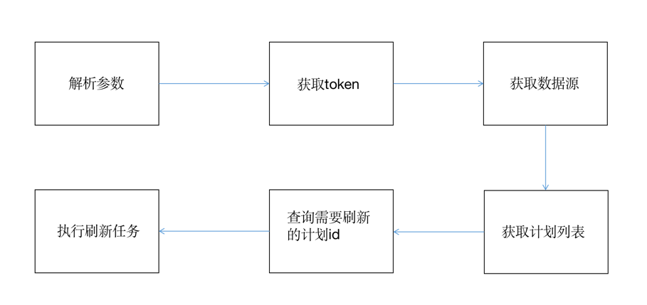

## 使用API实现刷新提取

### 需求：
* 问题：
Tableau任务提取刷新（数据源和报表）可以在管理后台实现，但其管理后台设置只支持固定时间启动（功能如同crontab）。这样计算任务和报表生效中间过程不能衔接起来，存在时延，报表的数据提取刷新时间需要考虑预留一定的buffer的情况下固定启动时间。如果计算任务比预期时间久则会出现数据非预期结果数据，造成一定困扰和返工低效率处理。
* 解决：Tableau任务提取刷新是否可以单独调用，有没有API机制？如能将此集成到大数据计算任务之后，则可以实现无缝连接

### 参考：
* 研究Tableau API调用，Tableau实现了restapi，并且提供了sample，注意：有API，则与版本相关，有认证调用的机制
1. restapi https://help.tableau.com/current/api/rest_api/en-us/REST/rest_api_ref_authentication.htm#sign_in
2. sample代码 https://github.com/tableau/rest-api-samples/tree/master/java

### 实现，形成此项目
1. 利用tableau sample实现-->结果跑不起来，根源sample的代码只是一个非常老的历史版本schema
2. 验证rest api是否有效-->api方式验证是OK的
3. 利用xjc + talbeau xml schema生成java代码，替换bindings下的代码
参考java xjc：xjc /path/ts-api_3_8.xsd -d /path/bindings
4. 使用匹配的api有版本和xsd版本，参与不同版本服务端对应的api版本和xsd版本
参考：https://help.tableau.com/current/api/rest_api/en-us/REST/rest_api_concepts_versions.htm
5. 熟悉rest api中调用方法，从第一个signin开始
参考：https://help.tableau.com/current/api/rest_api/en-us/REST/rest_api_ref_authentication.htm#sign_in

### 使用说明
1. 修改配置，验证版本是否匹配，生成jar
2. 利用jar包，如bin下，3.8版本

java -jar jar -c /path/ts-api_3_8.xsd -b "$1"
-参数1 必选
更新计划名称,如果需要刷新多个计划，使用逗号隔开，计划中有空格，添加引号。
可以更新整个计划。

java -jar jar -c /path/ts-api_3_8.xsd -b "$1" "$2"
-参数2 可选
参数1指定更新计划内的工作簿或数据源名称，如需更新多个，逗号隔开名称。
可以更新计划中指定的工作簿或数据源。

####3.执行流程

